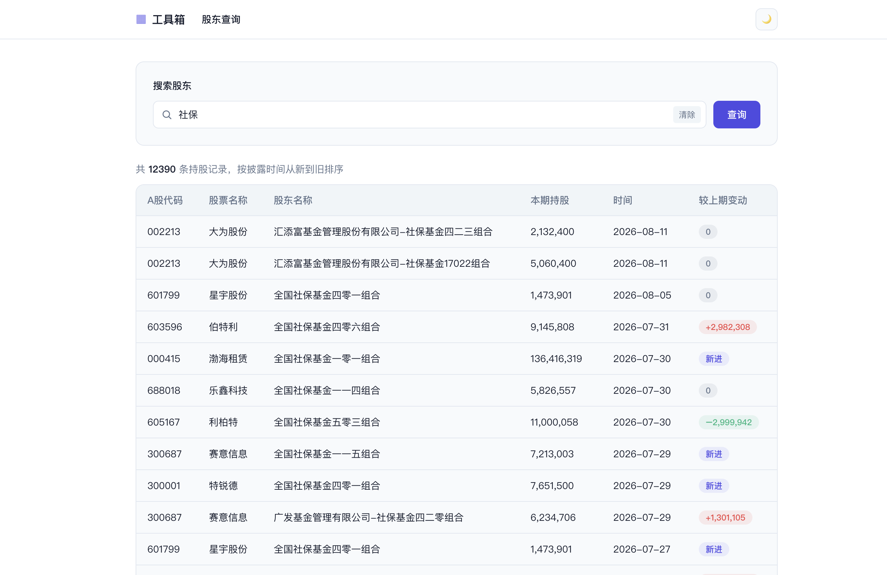

# 投资工具箱 — 股东查询

投资工具箱的第一个模块：输入**股东姓名**或 **A 股代码**，即可查看该股东/股票的持股记录与持仓变动。
数据来自公开行情接口，支持全市场覆盖与每日自动增量更新。

第二个模块：**微盘股筛选**——按钮触发，选出最近完整交易日总市值最低的 20 只 A 股
（沪深主板/中小板/创业板/科创板，不含北交所），排除 ST 及有 ST 风险的股票
（黑名单永久生效），历史结果按触发日期留存，可下拉回看近 20 次。

## 功能特性

- 按股东姓名（模糊）或 A 股代码查询持股记录
- 持股表格：千分位数字、披露时间倒序、较上期变动徽章（A 股红涨绿跌、新进标记）
- 分页、一键清除、改词重查
- 明暗主题切换（记住选择）、移动端适配
- 全 A 股（沪深北 5000+ 只）数据抓取，断点续传，服务内置每日增量更新
- 网站 PV 统计（今日 / 累计），持久化到 SQLite
- 微盘股筛选：低市值 20 强、ST/风险黑名单、按交易日去重、近 20 次历史回看

## 技术栈

- 前端：Vue 3 + Vue Router + Vite
- 后端：Python + FastAPI + SQLite
- 数据：东方财富行情/数据中心（股票列表、十大股东、公告）、新浪日K（交易日历）

## 截图



> 截图待补充：将图片保存为 `docs/screenshots/home.png` 即可自动展示。

## 目录结构

```
design/          # 设计稿（静态 HTML）
docs/            # PRD、实施计划、截图
frontend/        # Vue 3 前端
backend/         # Python FastAPI 后端（含爬虫、数据、API）
scripts/         # 冒烟测试等脚本
start.sh         # 一键启动脚本
Dockerfile       # 容器化部署
```

## 快速开始

### 一键启动（推荐）

```bash
./start.sh
```

自动构建前端并启动单个后端进程，同时提供页面与 API：
浏览器访问 http://localhost:8000

### 开发模式

后端（端口 8000）：

```bash
cd backend
python3 -m venv .venv
source .venv/bin/activate
pip install -r requirements.txt
uvicorn app.main:app --reload --port 8000
```

前端（端口 5173，`/api` 自动代理到后端）：

```bash
cd frontend
npm install
npm run dev
```

## 数据采集

数据源为东方财富数据中心（十大股东公开数据），存储于 `backend/data/shareholders.db`（SQLite）。

```bash
cd backend
source .venv/bin/activate
python -m app.crawler --once           # 抓取配置的股票池（TRACK_STOCKS）
python -m app.crawler --stock 600519   # 按 A 股代码抓取
python -m app.crawler --holder 贵州茅台 # 按股东姓名跨市场抓取
python -m app.crawler --market         # 全 A 股抓取：首次全量，之后每日增量
python -m app.crawler --market --force # 忽略断点，强制全量重抓
python -m app.crawler --market --limit 10  # 调试：只抓前 10 只
```

- 爬虫支持**断点续传**：每只股票成功抓取后记录时间戳，间隔内再次运行自动跳过已完成项
- **全市场模式**：先拉取全部 A 股列表（约 5000+ 只），再并发抓取十大股东；首次全量约 30~60 分钟，中断后重跑自动续传
- **服务内置增量爬虫**：后端启动时后台线程立即执行一次增量检查，之后每 24 小时自动更新，无需单独跑爬虫进程

## API

- `GET /health`：健康检查
- `GET /api/search?q=600519&page=1&page_size=20`：按股东姓名或 A 股代码查询，
  返回持股记录（按披露时间倒序），`q` 必填，`page >= 1`，`page_size 1~100`
- `GET /api/pv` / `POST /api/pv`：查询 / 记录 PV 统计（今日与累计）
- `POST /api/microcap/refresh`：触发微盘股筛选（同交易日自动复用已有结果）
- `GET /api/microcap/latest`：最新一次微盘股筛选结果
- `GET /api/microcap/dates`：近 20 次微盘股触发日期
- `GET /api/microcap/history?date=2026-08-07`：按日期查看历史筛选结果
- 接口文档：http://localhost:8000/docs

## 测试与验收

```bash
cd backend && python -m pytest          # 后端单元测试
cd frontend && npm run lint && npm run build  # 前端检查与构建
./scripts/smoke_test.sh                 # 全流程冒烟测试
```

## 部署

### Docker

```bash
docker build -t invest-tools .
docker run -p 8000:8000 invest-tools
```

### 配置项（环境变量）

| 变量 | 默认值 | 说明 |
|---|---|---|
| `TRACK_STOCKS` | `600519,000858,002594,300750` | 股票池（逗号分隔） |
| `CONCURRENCY` | `6` | 全市场抓取并发数 |
| `MARKET_PAGE_LIMIT` | `2` | 每只股票抓取页数 |
| `CRAWL_INTERVAL` | `3600` | 断点有效期（秒） |
| `SCHEDULE_INTERVAL` | `86400` | 内置增量爬虫间隔（秒，24 小时） |
| `ENABLE_SCHEDULED_CRAWL` | `1` | 是否启用内置增量爬虫（`0` 关闭） |
| `DB_PATH` | `backend/data/shareholders.db` | SQLite 数据库路径 |
